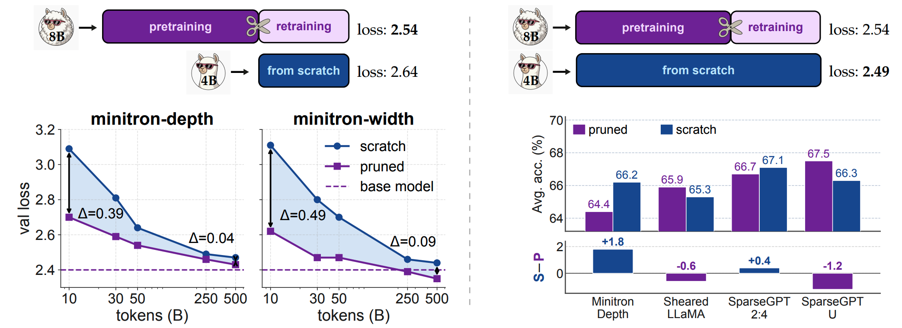

# Small LLMs: Pruning vs. Training from Scratch

[](https://arxiv.org/abs/2606.14150)

[Yufeng Xu<sup>1,2</sup>](https://github.com/Zephyr271828), [Taiming Lu<sup>1</sup>](https://taiminglu.com/), [Kunjun Li<sup>1</sup>](https://kunjun-li.github.io/), [Jiachen Zhu<sup>2</sup>](https://jiachenzhu.github.io/), [Mingjie Sun<sup>3</sup>](https://eric-mingjie.github.io/), and [Zhuang Liu<sup>1</sup>](https://liuzhuang13.github.io/)

<sup>1</sup> Princeton University &nbsp; <sup>2</sup> New York University &nbsp; <sup>3</sup> Carnegie Mellon University

---

Pruning promises a shortcut to strong small language models. We prune
**Llama-3.1-8B** at ratios **0.5–0.8** with **six methods** (depth, width, and
sparse granularities) under two token-matched settings, and find:

1. **Equal training-token budget** — pruned init consistently beats random init, though the gap shrinks with more tokens and higher pruning ratios.
2. **Equal total-token budget** — pruning still wins at fine granularities, while coarse structured pruning can be matched or surpassed.

**Takeaway:** with a pretrained model and a limited training budget, pruning wins; given an unlimited budget, training from scratch is competitive for coarse pruning.

<p align="center">
  
</p>

<p align="left">
  <em><b>Figure 1.</b> Pruning init beats random init, but the advantage shrinks as training
  scales. <b>Left:</b> at an equal training-token budget, pruning wins (the gap narrows with
  longer training). <b>Right:</b> given the full pipeline's token budget, random init becomes
  competitive.</em>
</p>

Pruning, training, and evaluation code are in our
library, which this repo calls into:
➡️ **[zlab-princeton/llm-pruning-collection](https://github.com/zlab-princeton/llm-pruning-collection)**

## Setup (notation)

| Symbol | Meaning |
|---|---|
| **S**_N_ | Train the target architecture from **S**cratch (random init) for _N_ B tokens |
| **P200-R**_N_ | **P**retrain a parent for 200B tokens, prune it, then **R**etrain the pruned model for _N_ B tokens |

- **Equal training-token budget:** `S50` vs. `P200-R50` (both see the same 50B retraining tokens) — isolates *initialization*.
- **Equal total-token budget:** `S250` vs. `P200-R50` (scratch gets all 200B + 50B = 250B tokens) — tests whether extra tokens close the gap.

- Data: [DCLM-Baseline-1.0](https://huggingface.co/datasets/mlfoundations/dclm-baseline-1.0). Pre-tokenized and shuffled version at
[`Zephyr271828/dclm-llama3-64-shuffled`](https://huggingface.co/datasets/Zephyr271828/dclm-llama3-64-shuffled)；
- Training Recipe: follows [Lingua](https://github.com/facebookresearch/lingua)；
- Training Code: TPU version adapted [MaxText](https://github.com/AI-Hypercomputer/maxtext); GPU version adapted from [fms-fsdp](https://github.com/foundation-model-stack/fms-fsdp); 
- Evaluation: TPU-adapted version from [lm-eval-harness](https://github.com/EleutherAI/lm-evaluation-harness).

## Prerequisites

These instructions assume you run on a **Google Cloud TPU VM** with a **GCS bucket** holding the data and checkpoints; training
uses MaxText. Set `BUCKET_NAME` to your bucket.

- A local clone of the library, with infra values set in [`scripts/run/env.sh`](scripts/run/env.sh):
  ```bash
  git clone https://github.com/zlab-princeton/llm-pruning-collection ~/llm-pruning-collection
  export LIB_DIR=~/llm-pruning-collection
  # edit scripts/run/env.sh: LIB_DIR, BUCKET_NAME, DATA_FILES
  ```
- The pre-tokenized, shuffled DCLM dataset, downloaded **into your bucket** (once):
  ```bash
  huggingface-cli download Zephyr271828/dclm-llama3-64-shuffled \
      --repo-type dataset --local-dir /tmp/dclm-llama3-64-shuffled
  gsutil -m cp -r /tmp/dclm-llama3-64-shuffled gs://$BUCKET_NAME/datasets/
  # DATA_FILES then points at gs://$BUCKET_NAME/datasets/dclm-llama3-64-shuffled/*.array_record
  ```

## Reproducing the experiments

All commands run on TPU and call into the library; examples use
**Minitron-width @ 50%** (`llama3.1-4b-width`).

### Stage 1 — Pretrain the parent (P200)

Train Llama-3.1-8B from scratch on 200B DCLM tokens. This produces a MaxText
(Orbax) checkpoint — the parent we prune.

```bash
bash scripts/run/pretrain_parent.sh            # wraps: scripts/training.sh --model=llama3.1-8b --num_steps=50000

# Convert the parent Orbax checkpoint → HuggingFace so the pruning code can load it:
cd $LIB_DIR/training/maxtext
# 1) generate a parameter-only (unrolled) checkpoint from the full training checkpoint
bash scripts/convert.sh gen_param_ckpt --model=llama3.1-8b --orbax_ckpt_name=<parent_run> --step=49999 --direct_run_name=<parent_direct>
# 2) convert it to a HuggingFace checkpoint
bash scripts/convert.sh orbax_to_hf --model=llama3.1-8b --orbax_ckpt_name=<parent_run> --step=49999 --hf_model_name=Llama-3.1-8B
```

### Stage 2 — Prune (in the library)

Pruning is implemented per-method in the library. Run it from the method's
directory — see its README for detailed, method-specific instructions:

- Minitron (depth/width), ShortGPT → [`pruning/minitron`](https://github.com/zlab-princeton/llm-pruning-collection/tree/main/pruning/minitron)
- Wanda, SparseGPT, Magnitude → [`pruning/wanda`](https://github.com/zlab-princeton/llm-pruning-collection/tree/main/pruning/wanda)
- Sheared LLaMA → [`pruning/llmshearing`](https://github.com/zlab-princeton/llm-pruning-collection/tree/main/pruning/llmshearing)
- FLAP (and Wanda-sp) → [`pruning/FLAP`](https://github.com/zlab-princeton/llm-pruning-collection/tree/main/pruning/FLAP)

```bash
# take minitron as an example
cd $LIB_DIR/pruning/minitron && bash scripts/install.sh && bash scripts/prune_llama3.1-8b.sh
```

The pruning methods operate on the **HuggingFace** checkpoint and emit a pruned
HuggingFace checkpoint. Convert it **back to MaxText (Orbax)** so it can be
retrained on TPU:

```bash
cd $LIB_DIR/training/maxtext
bash scripts/convert.sh hf_to_orbax --model=llama3.1-4b-width --orbax_ckpt_name=minitron_width_50pct --hf_model_name=<pruned_hf_ckpt>
```

### Stage 3 — Train for comparison (P200-R50 vs. S250)

Retrain the pruned init, and train the same architecture from scratch:

```bash
# P200-R50 — retrain the pruned init on 50B tokens (loads the converted pruned ckpt)
bash scripts/run/retrain_pruned.sh llama3.1-4b-width gs://$BUCKET_NAME/model_ckpts/maxtext/minitron_width_50pct/0/items

# S250 — train the same architecture from scratch on 250B tokens (random init)
bash scripts/run/train_from_scratch.sh llama3.1-4b-width 250
```

### Stage 4 — Evaluate the trained checkpoints

Eval reads a parameter-only "direct" checkpoint, so first generate one from the
trained run (`gen_param_ckpt`), then evaluate it.

```bash
cd $LIB_DIR/training/maxtext

# P200-R50 (50B run → step 12499)
bash scripts/convert.sh gen_param_ckpt --model=llama3.1-4b-width --orbax_ckpt_name=<p200_r50_run> --step=12499 --direct_run_name=<p200_r50_direct>
bash scripts/convert.sh eval           --model=llama3.1-4b-width --direct_run_name=<p200_r50_direct> --hf_model_name=Llama-3.1-8B

# S250 (250B run → step 62499)
bash scripts/convert.sh gen_param_ckpt --model=llama3.1-4b-width --orbax_ckpt_name=<s250_run> --step=62499 --direct_run_name=<s250_direct>
bash scripts/convert.sh eval           --model=llama3.1-4b-width --direct_run_name=<s250_direct> --hf_model_name=Llama-3.1-8B
```

Equivalently, via the wrapper (which runs both steps): `bash scripts/run/eval.sh llama3.1-4b-width <run_name> <step>`.
See [`scripts/README.md`](scripts/README.md) for details.

## Acknowledgement

We gratefully acknowledge the generous support of the
[Google TPU Research Cloud (TRC)](https://sites.research.google/trc/about/), which
provided the computational resources used in this work, the Neuronic GPU cluster
of the Princeton Department of Computer Science, and Princeton Research Computing
(PICSciE). Built on top of [MaxText](https://github.com/google/maxtext).

## License

Released under the [Apache-2.0 License](LICENSE).

## Citation

```bibtex
@article{xu2026smallllms,
  title   = {Small LLMs: Pruning vs. Training from Scratch},
  author  = {Xu, Yufeng and Lu, Taiming and Li, Kunjun and Zhu, Jiachen and Sun, Mingjie and Liu, Zhuang},
  year    = {2026},
  journal = {arXiv preprint arXiv:2606.14150}
}
```
